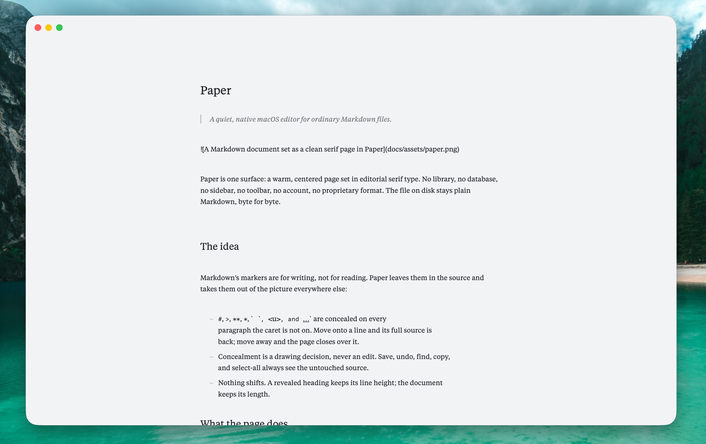

# Paper

> A quiet, native macOS editor for ordinary Markdown files.



Paper is one surface: a warm, centered page set in editorial serif type. No library, no database, no sidebar, no toolbar, no account, no proprietary format. The file on disk stays plain Markdown, byte for byte.


## The idea

Markdown's markers are for writing, not for reading. Paper leaves them in the source and takes them out of the picture everywhere else:

- `#`, `>`, `**`, `*`, `` ` ``, `<u>`, and `[…](…)` are concealed on every
  paragraph the caret is not on. Move onto a line and its full source is
  back; move away and the page closes over it.
- Concealment is a drawing decision, never an edit. Save, undo, find, copy,
  and select-all always see the untouched source.
- Nothing shifts. A revealed heading keeps its line height; the document
  keeps its length.

## What the page does

- *Typography* — a centered measure with real margins; headings stepped
  from the body size; block quotes inset and italic behind a hairline rule.
- *Lists* — Apple Notes' two kinds: `-` draws as a dashed list (–), `*`
  as a bulleted one (•). Items hang under their text, hard-wrapped lines
  align, and ordered markers may carry a letter (`1a)`).
- **Links** — underlined text with the syntax concealed. ⌘-click opens the
  destination; relative paths resolve against the document.
- **Typed substitutions** — `->` becomes → as you type, like smart dashes;
  ⌘Z gives the pair back.
- **Wheel scrolling** — mouse-wheel notches ease toward their target
  instead of jumping; trackpad scrolling stays native.

## Shortcuts

| Keys | Action |
| --- | --- |
| ⌘B / ⌘I / ⌘U / ⌘E | toggle `**bold**`, `*italic*`, `<u>underline</u>`, `` `code` `` around the selection or word |
| ⌘K | add a link, destination from the clipboard when it holds a URL |
| ⌘-click | open a link |
| ⌘, | settings |


## Settings are a text file

Everything lives in `~/.config/paper/config` (`$XDG_CONFIG_HOME` honoured), written as a commented template on first launch and applied live to open windows whenever it is saved:

```ini
font.family = Test Tiempos Text
font.size = 16
line.height = 1.11
letter.spacing = 0.02
measure = 655
theme = slate
window.width = 1374
window.height = 877
```

Themes: `paper`, `sepia`, `slate`, `mono`, `spatial-dark`, `apple-dark`,
each with light and dark palettes, plus per-colour hex overrides. The
Settings window (⌘,) edits the same keys with controls and writes them back
into the file, comments preserved. Named presets are files too, in
`~/.config/paper/presets/`; edits write through to the active preset.

## Native

A SwiftUI document app around an AppKit `NSTextView`, TextKit 1, Swift 6
strict concurrency, zero dependencies. New, open, save, autosave, Versions,
undo, find, spelling, dictation, and multiwindow behave the way Mac
documents behave. UTF-8 round-trips exactly, byte-order marks and CRLF
included.

## Build

Paper uses [XcodeGen](https://github.com/yonaskolb/XcodeGen); the project
file is generated from `project.yml`.

```bash
xcodegen generate
xcodebuild -project Paper.xcodeproj -scheme Paper -configuration Release build
```

Tests:

```bash
xcodebuild -project Paper.xcodeproj -scheme Paper \
  -destination 'platform=macOS' test
```

The build is warning-free. Tests cover byte-exact round trips, concealment
geometry (line and document height never change on reveal), list and quote
layout, undo paths, and the invariant that styling never edits the text.
Setting `TEST_RUNNER_PAPER_PROBE_DIR=<dir>` additionally writes offscreen
renders and restyle timings there for review — the screenshot above is one
of those renders.

## More

- [Architecture](docs/architecture.md)
- [ADR-001 — Native document editor](docs/decisions/001-native-editor.md)
