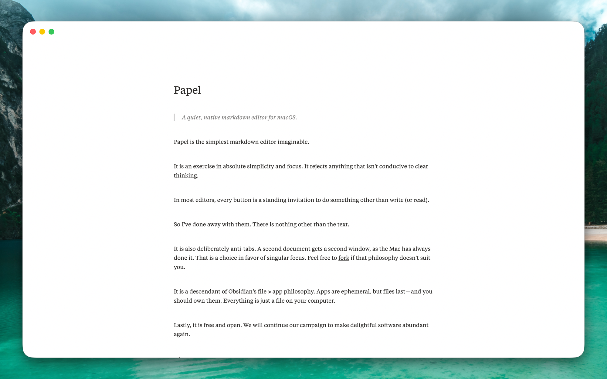

# Papel

> A quiet, native markdown editor for macOS.



Papel is the simplest markdown editor imaginable.

It is an exercise in absolute simplicity and focus. It rejects anything that isn’t conducive to clear thinking.

In most editors, every button is a standing invitation to do something other than write (or read). 

So I’ve done away with them. There is nothing other than the text.

It is also deliberately anti-tabs. A second document gets a second window, as the Mac has always done it. That is a choice in favor of singular focus. Feel free to [fork](https://github.com/humanitas-labs/papel/fork) if that philosophy doesn’t suit you.

It is a descendant of Obsidian’s file > app philosophy. Apps are ephemeral, but files last—and you should own them. Everything is just a file on your computer.

Lastly, it is free and open. We will continue our campaign to make delightful software abundant again.

## Shortcuts

| Keys | Action |
| --- | --- |
| ⌘B / ⌘I / ⌘U / ⌘E | toggle `**bold**`, `*italic*`, `<u>underline</u>`, `` `code` `` around the selection or word |
| ⌘K | add a link, destination from the clipboard when it holds a URL |
| click / ⌘-click | open a link |
| double-click an image | open it in Quick Look |
| ⌘, | settings |

## Configuration

Everything lives in `~/.config/papel/config` (`$XDG_CONFIG_HOME` honoured), written as a commented template on first launch and applied live to open windows whenever it is saved:

```ini
font.family = New York
font.size = 16
line.height = 1.11
letter.spacing = 0.02
measure = 655
theme = slate
window.width = 1374
window.height = 877
```

## Command line

The app bundles a small launcher. Put it on your PATH once:

```sh
ln -s /Applications/Papel.app/Contents/Resources/papel /usr/local/bin/papel
```

Then `papel notes.md` opens a document, creating it first when it doesn't exist yet, and `papel` alone opens the app.

## Default app for Markdown

To make double-clicking a `.md` file open Papel: select any Markdown file in Finder, press ⌘I (Get Info), choose Papel under *Open with*, and click *Change All*… — that applies to every `.md` file. Repeat once for `.markdown` if you use that extension.

## More

- [Build and test](docs/build.md)
- [Architecture](docs/architecture.md)
- [Using Papel with Claude](docs/claude.md)
